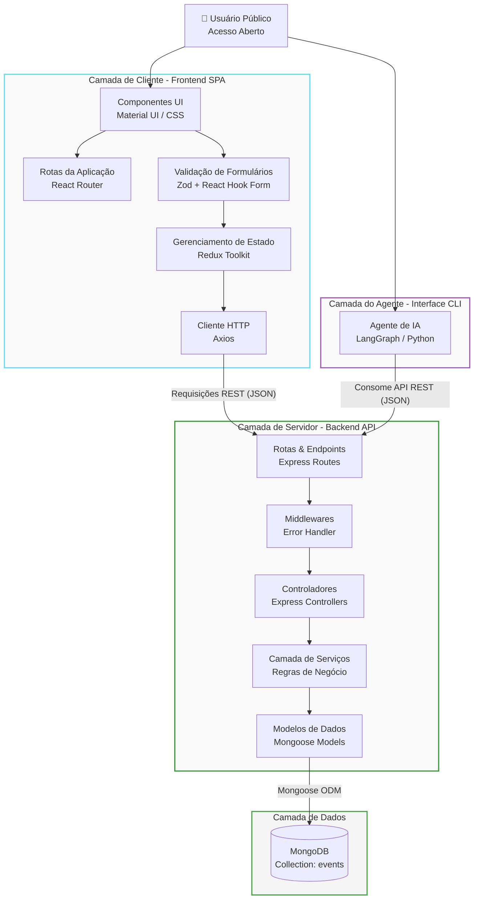

# Sistema de Gestão de Eventos

## Descrição do Projeto
O **Sistema de Gestão de Eventos** é uma aplicação web completa desenvolvida para gerenciar e visualizar eventos acadêmicos. O sistema possui acesso aberto (sem controle de usuários ou login), permitindo cadastrar, editar, excluir e visualizar os eventos livremente. A plataforma conta com uma interface intuitiva, listando os eventos separados por "Futuros" e "Passados", e oferece recursos de busca textual e ordenação, facilitando a usabilidade.

## Apresentação no Youtube
https://youtu.be/Ry7Zq1XsK3I

## Stack Tecnológica

### Frontend
- **React**: Biblioteca principal para construção da interface de usuário em formato SPA.
- **TypeScript**: Tipagem estática para JavaScript, garantindo maior segurança e manutenibilidade do código.
- **Material UI (MUI)**: Biblioteca base para componentes de interface.
- **React Hook Form + Zod**: Ferramentas para manipulação, controle e validação rigorosa de formulários.
- **Redux Toolkit**: Gerenciamento de estado global da aplicação.
- **CSS Puro**: Utilizado para estilizações customizadas não supridas pelo MUI.
- **ESLint**: Ferramenta de linting para assegurar padrões de código.
- **Jest & React Testing Library**: Frameworks para criação de testes unitários e de integração no frontend.

### Backend
- **Node.js**: Ambiente de execução JavaScript no servidor.
- **Express**: Framework web minimalista para construção da API RESTful.
- **TypeScript**: Tipagem estática para maior previsibilidade no backend.
- **MongoDB**: Banco de dados NoSQL, responsável pela persistência das informações de eventos.

### Ferramentas de IA
- **Google Antigravity**: Ferramenta de IA para auxiliar na escrita de código.
- **Gemini 3.0**: Ferramenta de IA para auxiliar na escrita de código e documentação.

## Estrutura do Projeto
O projeto é um monorepo contendo duas partes principais na raiz:
- `/frontend`: Aplicação Web SPA para a interface do usuário.
- `/backend`: API REST para fornecer os dados e regras de negócio.
- `/agent`: Agente de Inteligência Artificial usando LangGraph/LangChain que consulta a API de eventos em linguagem natural.

## 🚀 Como Executar o Projeto

### Pré-requisitos

Certifique-se de ter instalado em sua máquina:

- **[Node.js](https://nodejs.org)** v18 ou superior
- **MongoDB** rodando localmente na porta `27017`

> **Dica (MongoDB via Docker):**  
> A maneira mais fácil de rodar o banco localmente é ter o Docker instalado e executar:
> ```bash
> docker run -d -p 27017:27017 --name mongo-gestao mongo
> ```
> *(Alternativamente, você pode usar uma URI remota como o [MongoDB Atlas](https://www.mongodb.com/atlas))*

---

### 1. Backend

```bash
# 1. Acesse a pasta do backend
cd backend

# 2. Instale as dependências
npm install

# 3. Copie e configure o arquivo de variáveis de ambiente
cp .env.example .env
# Abra o .env e ajuste os valores:
#   PORT=3001
#   MONGODB_URI=mongodb://localhost:27017/gestao-eventos

# 4. Inicie o servidor em modo desenvolvimento
npm run dev
```

✅ O servidor estará disponível em **`http://localhost:3001`**  
Os endpoints da API ficam em `http://localhost:3001/api/events`

---

### 2. Frontend

> **Atenção:** o backend deve estar rodando antes de iniciar o frontend.

```bash
# Em um novo terminal, acesse a pasta do frontend
cd frontend

# Instale as dependências
npm install

# Inicie o servidor de desenvolvimento
npm run dev
```

✅ A aplicação estará disponível em **`http://localhost:5173`**

---

### 3. Agente de IA (LangGraph)

O agente pode ser executado via terminal e permite interagir com o sistema usando linguagem natural.

- **Consulta e Criação de Eventos:** O agente faz a consulta e criação de eventos consumindo os endpoints da API que está no mesmo projeto;
- **Chave de API:** Para executá-lo, precisa de uma chave de API, que pode ser gerada a partir do link [https://aistudio.google.com/api-keys?project=gen-lang-client-0519587524](https://aistudio.google.com/api-keys?project=gen-lang-client-0519587524);
- **Apresentação do Funcionamento:** A apresentação sobre o funcionamento do agente está no próprio repositório, e é o arquivo [docs/IntelligentEventAgent.pdf](docs/IntelligentEventAgent.pdf);

#### ⚙️ Funcionamento e Fluxo de Execução
O agente foi construído seguindo a arquitetura **ReAct (Reasoning and Acting)** com LangGraph, organizando-se no seguinte fluxo:
1. **Entrada do Usuário:** O usuário envia uma pergunta ou instrução no terminal em linguagem natural.
2. **Nó do Agente (`agent`):** O modelo `gemini-2.5-flash` processa o histórico do estado e decide se precisa chamar alguma ferramenta para responder à solicitação.
3. **Decisão Condicional (`should_continue`):**
   - Se o modelo decidir chamar uma ferramenta, o fluxo é direcionado para o nó `tools`.
   - Se o modelo já possuir todas as informações necessárias, ele gera a resposta final e o fluxo é encerrado (`END`).
4. **Nó das Ferramentas (`tools`):** Executa a ferramenta solicitada, insere o resultado no estado compartilhado do agente e retorna o controle para o nó do `agent` para processar a resposta final.

#### 🔧 Ferramentas Integradas (Tools)
- **`consultar_eventos`:** Consome o endpoint HTTP GET `/api/events` do backend e retorna uma listagem em formato JSON dos eventos cadastrados no banco de dados MongoDB.
- **`cadastrar_evento`:** Consome o endpoint HTTP POST `/api/events` enviando os parâmetros fornecidos pelo usuário (`nome`, `descricao`, `data_hora`, `local`, `categoria`). A categoria é validada estritamente contra as opções aceitas: *Conferência, Workshop, Webinar, Networking, Outro*.

#### 💡 Decisões Arquiteturais e Limitações
* **Decisões:**
  - Escolha do modelo `gemini-2.5-flash` devido ao seu custo-benefício, rapidez de resposta e excelente assertividade em chamadas de ferramentas (Function Calling).
  - Utilização do estado do LangGraph com `add_messages` para gerenciar a cadeia de mensagens e o contexto de execução de forma estruturada.
* **Limitações:**
  - O agente depende diretamente da API REST backend estar em execução para consultar ou cadastrar eventos.
  - O terminal interativo atualmente executa de forma stateless para cada pergunta (não retém histórico de conversas entre perguntas consecutivas no terminal, apenas o contexto interno durante a execução de um mesmo fluxo/turno de raciocínio).

#### 💬 Exemplos de Entrada e Saída
* **Exemplo de Consulta de Eventos:**
  ```text
  Você: Quais são os eventos cadastrados?
  🔧 (Acessando ferramenta: consultar_eventos...)
  
  Agente: Atualmente temos os seguintes eventos cadastrados:
  1. Python Workshop (Categoria: Workshop) - Local: São Paulo, SP em 30 de julho de 2026.
  2. JavaScript Conference (Categoria: Conferência) - Local: Florianópolis em 20 de julho de 2027.
  ```

* **Exemplo de Cadastro de Evento:**
  ```text
  Você: Cadastre um evento chamado "Workshop IA" na data 2026-08-20 na Arena Digital, categoria Workshop, com a descrição "Aprenda sobre agentes de IA".
  🔧 (Acessando ferramenta: cadastrar_evento...)
  
  Agente: O evento 'Workshop IA' foi cadastrado com sucesso! ID da criação no banco de dados: 6699a9cfb1836a0d4c241a78
  ```

---

> **Atenção:** O backend deve estar rodando para que o agente consiga buscar e cadastrar os eventos. O agente requer uma chave válida da API do Google Gemini.

```bash
# 1. Acesse a pasta do agente
cd agent

# 2. Ative o ambiente virtual (se aplicável)
source venv/bin/activate

# 3. Instale as dependências
pip install -r requirements.txt

# 4. Variáveis de ambiente
cp .env.example .env
# IMPORTANTE: Coloque sua chave GOOGLE_API_KEY no arquivo .env

# 5. Execute o agente interativo
python src/main.py
```

---

### Scripts disponíveis

| Pasta | Comando | Descrição |
|-------|---------|-----------|
| `backend` | `npm run dev` | Servidor com hot-reload (ts-node-dev) |
| `backend` | `npm run build` | Compila TypeScript para `dist/` |
| `backend` | `npm test` | Executa os testes unitários (Jest) |
| `backend` | `npm run lint` | Verifica o código com ESLint |
| `frontend` | `npm run dev` | Dev server Vite |
| `frontend` | `npm run build` | Build de produção |
| `frontend` | `npm test` | Executa os testes unitários (Vitest) |
| `frontend` | `npm run lint` | Verifica o código com ESLint |
| `agent` | `python src/main.py` | Executa o agente de IA no terminal |

## 📌 Arquitetura do Sistema

O projeto adota uma arquitetura dividida em duas camadas principais (Frontend SPA e Backend API RESTful), utilizando comunicação assíncrona via protocolo HTTP e persistência em banco de dados NoSQL. O sistema possui acesso aberto, sem controle de autenticação.

